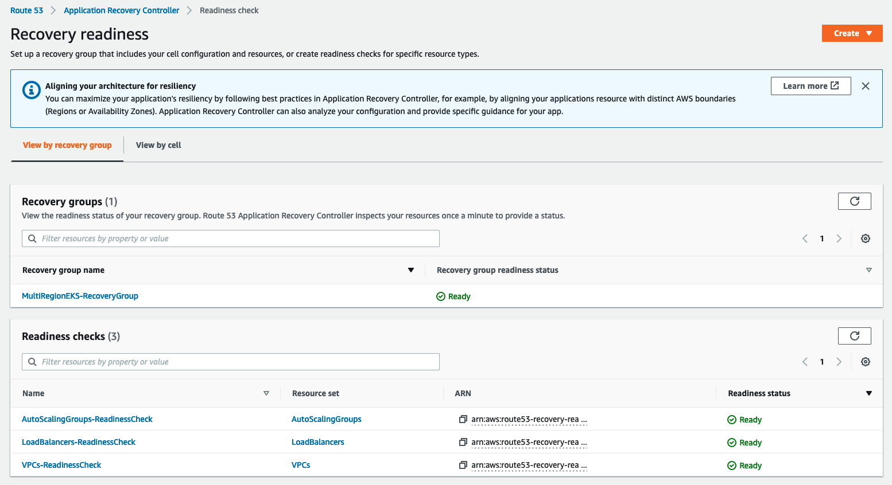
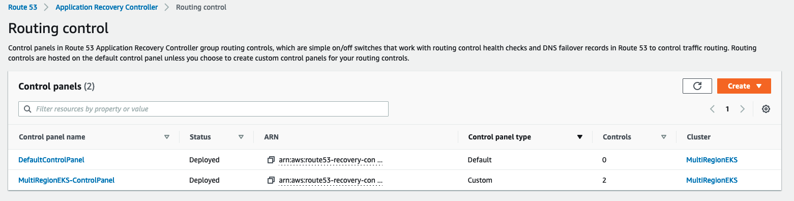
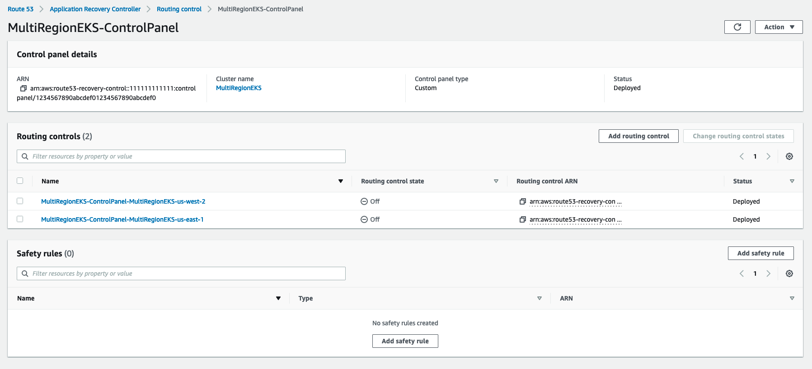
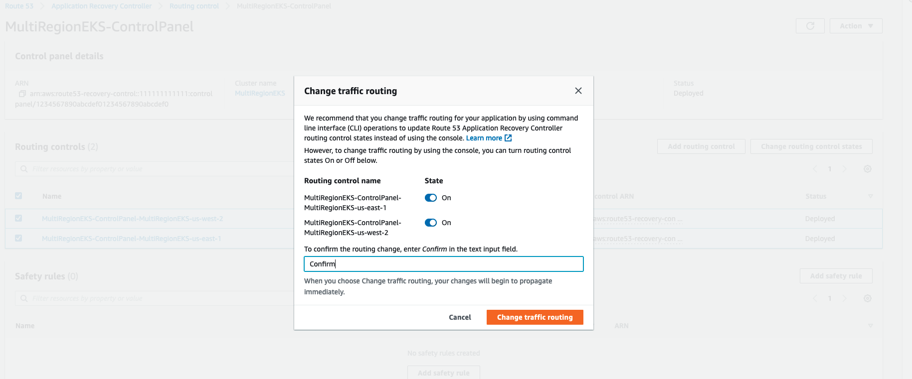
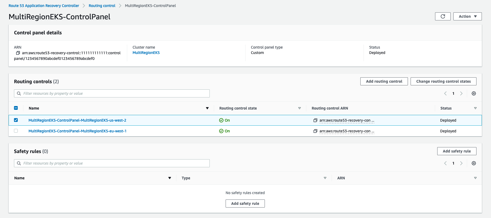
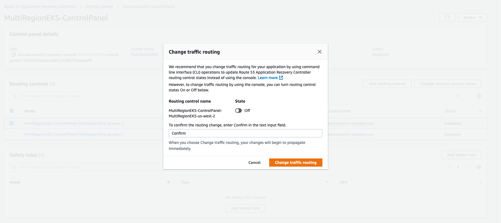

# gitops-eks-r53-arc

## Deploy the solution

### Prerequisites

- [Git](https://git-scm.com/)
- [AWS Command Line Interface (CLI)](https://docs.aws.amazon.com/cli/latest/userguide/getting-started-install.html)
- [NodeJS](https://nodejs.org)
- [AWS Cloud Development Kit (CDK)](https://docs.aws.amazon.com/cdk/v2/guide/getting_started.html)
- [Flux](https://fluxcd.io/flux/installation/)
- [Route 53 Public Hosted Zone configured](https://docs.aws.amazon.com/Route53/latest/DeveloperGuide/CreatingHostedZone.html)

Clone the [solution repository from AWS Samples](ttps://github.com/aws-samples/gitops-eks-r53-arc) and navigate to the parent folder:

```bash
git clone git@github.com:aws-samples/gitops-eks-r53-arc.git
cd gitops-eks-r53-arc
```

This repository contains:

- `app/`: a set of Kubernetes manifests to deploy a 3rd-party sample application;
- `infra/`: a CDK application that will deploy and configure the corresponding AWS services for you

> AWS CDK is a framework for defining cloud infrastructure in code and provisioning it through AWS CloudFormation. AWS CDK lets you build reliable, scalable, cost-effective applications in the cloud with the considerable expressive power of a programming language. Please refer to [AWS CDK documentation](https://docs.aws.amazon.com/cdk/v2/guide/home.html) to learn more.

## Bootstrap CDK

To start deploying the solution you need to install and initialize CDK first. Navigate into the `infra` repository and run the following in your preferred terminal:

```bash
cd infra
npm install 
cdk bootstrap
```

## Deploy EKS clusters

After the bootstrapping process you're ready to deploy our CDK application, comprised by different stacks. Each CDK stack will match 1:1 with an AWS CloudFormation one. The first two stacks will deploy two EKS clusters in different AWS Regions, one in us-west-2 (Oregon) and the other in eu-west-1 (Ireland): 


```
cdk deploy US-EKSStack EMEA-EKSStack --require-approval never
```

It will take around 20-30 minutes to deploy _each_ stack. 

Run the following commands and add the relevant outputs for both stacks as environment variables to be used on later steps:

```bash
export US_EKS_ASG=$(aws cloudformation describe-stacks --stack-name US-EKSStack \
  --query "Stacks[0].Outputs[?OutputKey=='EKSASGArn'].OutputValue" \
  --output text --region us-west-2)
export EMEA_EKS_ASG=$(aws cloudformation describe-stacks --stack-name EMEA-EKSStack \
  --query "Stacks[0].Outputs[?OutputKey=='EKSASGArn'].OutputValue" \
  --output text --region eu-west-1)
export US_EKS_KUBECONFIG=$(aws cloudformation describe-stacks --stack-name US-EKSStack \
  --query "Stacks[0].Outputs[?starts_with(OutputKey, 'EKSClusteruswest2ConfigCommand')].OutputValue" \
  --output text --region us-west-2)
export EMEA_EKS_KUBECONFIG=$(aws cloudformation describe-stacks --stack-name EMEA-EKSStack \
  --query "Stacks[0].Outputs[?starts_with(OutputKey, 'EKSClustereuwest1ConfigCommand')].OutputValue" \
  --output text --region eu-west-1)
export US_EKS_VPC=$(aws cloudformation describe-stacks --stack-name US-EKSStack \
  --query "Stacks[0].Outputs[?OutputKey=='EKSVPCArn'].OutputValue" \
  --output text --region us-west-2)
export EMEA_EKS_VPC=$(aws cloudformation describe-stacks --stack-name EMEA-EKSStack \
  --query "Stacks[0].Outputs[?OutputKey=='EKSVPCArn'].OutputValue" \
  --output text --region eu-west-1)
```

Add configuration for each EKS cluster on your local `kubeconfig` by running the following:

```bash
eval $US_EKS_KUBECONFIG && eval $EMEA_EKS_KUBECONFIG
```

> Please note that this CDK example was designed for demonstration purposes only and should not be used in production environments as is. Please refer to [EKS Best Practices](https://aws.github.io/aws-eks-best-practices/), specially the [Security Best Practices section](https://aws.github.io/aws-eks-best-practices/security/docs/) to learn how to properly run production Kubernetes workloads on AWS.


## Create a CodeCommit Repository

> You can choose to use a different Git repository, such as GitHub or Gitlab. Refer to Flux documentation on how to setup your cluster with them: [Github](https://fluxcd.io/docs/cmd/flux_bootstrap_github/) | [Gitlab](https://fluxcd.io/docs/cmd/flux_bootstrap_gitlab/)

```bash
cdk deploy CodeCommitRepositoryStack --require-approval never
```

> As of the time this blog post was written AWS CodeCommit does not offer a native replication mechanism across AWS Regions. You should consider your high-availability requirements and plan accordingly. You can build your own solution to [replicate AWS CodeCommit Repositories between Regions using AWS Fargate](https://aws.amazon.com/blogs/devops/replicate-aws-codecommit-repository-between-regions-using-aws-fargate/), for example.


Run the command below to save your recently created repository URL as an environment variable to be used later:

```bash
export CODECOMMIT_REPO_URL=$(aws cloudformation describe-stacks \
  --stack-name CodeCommitRepositoryStack  \
  --query "Stacks[0].Outputs[?OutputKey=='CodeCommitRepoUrl'].OutputValue" \
  --region us-west-2 --output text)
```

### Generate SSH Key pair for the CodeCommit user

Generate a SSH key pair for the `gitops` IAM user which will have permissions to CodeCommit repository, generated by `CodeCommitRepositoryStack` stack and [upload the public one to AWS IAM](https://console.aws.amazon.com/iam/home#/users/flux?section=security_credentials).

```bash
ssh-keygen -t rsa -C "gitops" -b 4096 -f id_rsa_gitops -N ""
aws iam upload-ssh-public-key --ssh-public-key-body file://id_rsa_gitops.pub --user-name gitops
```

Save the SSH key ID after the upload:

```bash
export SSH_KEY_ID=$(aws iam list-ssh-public-keys --user-name gitops \
  --query 'SSHPublicKeys[0].SSHPublicKeyId' --output text)
```     

## Bootstrap Flux

### Bootstrapping Flux with your CodeCommit repository

Add the CodeCommit SSH Key to your `~/.ssh/known_hosts` file:

```bash
 ssh-keyscan -H git-codecommit.us-west-2.amazonaws.com >> ~/.ssh/known_hosts
 ```

Append the SSH Key ID with the `SSH_KEY_ID` environment variable you saved earlier to have the SSH URL formed and bootstrap Flux on **each EKS cluster** by running the following: 

```bash
flux bootstrap git --url=$(echo $CODECOMMIT_REPO_URL | sed "s/ssh:\/\//ssh:\/\/$SSH_KEY_ID@/g") --username $SSH_KEY_ID --private-key-file id_rsa_gitops
```

> Your final SSH URL should be something like `ssh://APKAEIBAERJR2EXAMPLE@git-codecommit.us-west-2.amazonaws.com/v1/repos/gitops-repo`. Make sure you confirm giving key access to the repository, answering `y` when prompted.

Change your current kubectl context to the other EKS cluster and re-run the `flux bootstrap` command:

```bash
AWS_ACCOUNT_ID=$(aws sts get-caller-identity --query Account --output text)
kubectl config use-context "arn:aws:eks:us-west-2:${AWS_ACCOUNT_ID}:cluster/eks-cluster-us-west-2"
flux bootstrap git --url=$(echo $CODECOMMIT_REPO_URL | sed "s/ssh:\/\//ssh:\/\/$SSH_KEY_ID@/g") --username $SSH_KEY_ID --private-key-file id_rsa_gitops
```

> Here we’re using SSH connection to CodeCommit specifically for Flux compatibility and temporary credentials should always [be your first choice](https://docs.aws.amazon.com/codecommit/latest/userguide/setting-up-git-remote-codecommit.html).


### Adding a demo application to the `gitops-repo` repository

Clone the `gitops-repo` repository using your preferred method. In this case we're using the HTTPS repository URL with the [CodeCommit Credential Helper provided by AWS CLI](https://docs.aws.amazon.com/codecommit/latest/userguide/setting-up-https-unixes.html):

```bash
cd ..
git config --global credential.helper '!aws codecommit credential-helper $@'
git config --global credential.UseHttpPath true
git clone $(echo $CODECOMMIT_REPO_URL | sed "s/ssh:\/\//https:\/\//g")
```

Copy everything from `app` folder to the `gitops-repo` folder:

```bash
cp -R app/* gitops-repo
```

The `app` folder contains our sample application that will be deployed in the two EKS clusters. It will use the [microservices-demo](https://github.com/microservices-demo/microservices-demo) app plus an [Ingress](https://kubernetes.io/docs/concepts/services-networking/ingress/) backed by [AWS Load Balancer Controller](https://kubernetes-sigs.github.io/aws-load-balancer-controller/). Please note that [microservices-demo](https://github.com/microservices-demo/microservices-demo) is owned and maintained by a [3rd party](https://www.weave.works/).

Navigate into `gitops-repo` directory and push the changes to the remote `gitops-repo` repository:

```bash
cd gitops-repo
git add .
git commit -m "Add microservices-demo to the gitops repo"
git push origin main
cd ..
``` 

After a few minutes Flux will deploy the demo application with an Application Load Balancer exposing your application to the world.

Save the created Application Load Balancers ARNs on `us-west-2` and `eu-west-1` as environment variables:

```bash
export US_EKS_ALB=$(aws elbv2 describe-load-balancers --query "LoadBalancers[?starts_with(DNSName, 'microservices-demo')].LoadBalancerArn" --region us-west-2 --output text)
export EMEA_EKS_ALB=$(aws elbv2 describe-load-balancers --query "LoadBalancers[?starts_with(DNSName, 'microservices-demo')].LoadBalancerArn" --region eu-west-1 --output text)
```

## Deploy the Route 53 Application Recovery Controller stack

For this step you will use the environment variables we saved earlier plus the Application Load Balancers ARNs:

```bash
cd infra
cdk deploy Route53ARCStack --parameters uswest2ASG=$US_EKS_ASG --parameters euwest1ASG=$EMEA_EKS_ASG --parameters uswest2VPC=$US_EKS_VPC --parameters euwest1VPC=$EMEA_EKS_VPC --parameters uswest2ALB=$US_EKS_ALB --parameters euwest1ALB=$EMEA_EKS_ALB
```

As part of this deployment, two Route 53 Health Checks will be created. Save the ID of each of them for later use:

```bash
export US_R53_HEALTH_CHECK_ID=$(aws cloudformation describe-stacks --stack-name Route53ARCStack --query "Stacks[0].Outputs[?starts_with(OutputKey, 'Route53ARCStackMultiRegionEKSuswest2HealthCheckId')].OutputValue" --output text --region us-west-2)
export EMEA_R53_HEALTH_CHECK_ID=$(aws cloudformation describe-stacks --stack-name Route53ARCStack --query "Stacks[0].Outputs[?starts_with(OutputKey, 'Route53ARCStackMultiRegionEKSeuwest1HealthCheckId')].OutputValue" --output text --region us-west-2)
```

### Take a look on Route 53 Application Recovery Controller Console

At this point you should have the following deployed:

1. 2 EKS clusters (one per region)
2. 2 ALB load balancers (one per region)
3. 1 Route 53 ARC Cluster 
4. 1 Route 53 ARC Recovery group with two cells (one per region) with VPCs, ASGs and ALBs bundled into their respective resource sets
5. 2 Route 53 ARC Routing Controls (one per region) and 2 Route 53 Health Checks linked together


Let’s open the [Route 53 Application Recovery Controller Console](https://us-west-2.console.aws.amazon.com/route53recovery/home) and open the  [Readiness check portion](https://us-west-2.console.aws.amazon.com/route53recovery/home#/readiness/home) of it. It’s under the Multi-Region section of the left-side navigation pane:



With Readiness check you can programmatically make sure your application (recovery group) and its cells are healthy which means your application is ready to failover.

Let's move to the [Routing control portion](https://us-west-2.console.aws.amazon.com/route53recovery/home#/recovery-control/home) of Route 53 ARC. It's also within Multi-Region section of the left-side navigation pane:



Click on the `MultiRegionEKS-ControlPanel` control panel:



### Turning your routing controls on

By default, recently created routing controls are switched off which means the corresponding Route 53 Health Check will be on the unhealthy state, preventing traffic to be routed. Select the two routing controls created for you, click on `Change routing control states`, turn them `On`, enter `Confirm` on the text input field and click on `Change traffic routing` so we can configure our Route 53 Hosted Zone properly:



## Let's set our Route 53 Hosted Zone to use those two new Health checks

Find your existing Route 53 Hosted Zone ID by running the following command. Make sure you replace `example.com` with the public domain you own:

```bash
export R53_DNS_NAME="example.com"
export R53_HOSTED_ZONE=$(aws route53 list-hosted-zones --query "HostedZones[?Name=='$R53_DNS_NAME.'].Id" --output text | sed "s/\/hostedzone\///g")
```

Let's extract the information we need to create our Route 53 records from each load balancer:

```bash
export US_EKS_ALB_ZONE_ID=$(aws elbv2 describe-load-balancers --region us-west-2 --query "LoadBalancers[0].CanonicalHostedZoneId" --output text --load-balancer-arns $US_EKS_ALB)
export US_EKS_ALB_DNS_NAME=$(aws elbv2 describe-load-balancers --region us-west-2 --query "LoadBalancers[0].DNSName" --output text --load-balancer-arns $US_EKS_ALB)
export EMEA_EKS_ALB_ZONE_ID=$(aws elbv2 describe-load-balancers --region eu-west-1 --query "LoadBalancers[0].CanonicalHostedZoneId" --output text --load-balancer-arns $EMEA_EKS_ALB)
export EMEA_EKS_ALB_DNS_NAME=$(aws elbv2 describe-load-balancers --region eu-west-1 --query "LoadBalancers[0].DNSName" --output text --load-balancer-arns $EMEA_EKS_ALB)
```


Now we'll create the corresponding Route 53 records. First, we need to generate a file with the changes per the [change-resource-record-sets](https://awscli.amazonaws.com/v2/documentation/api/latest/reference/route53/change-resource-record-sets.html) CLI command documentation:

```bash
cat << EOF > changes.json 
{
  "Changes": [
    {
      "Action": "CREATE",
      "ResourceRecordSet": { 
        "Name": "service.$R53_DNS_NAME", 
        "Type": "A", 
        "SetIdentifier": "US", 
        "Failover": "PRIMARY", 
        "AliasTarget": { 
          "HostedZoneId": "$US_EKS_ALB_ZONE_ID", 
          "DNSName": "$US_EKS_ALB_DNS_NAME", 
          "EvaluateTargetHealth": true 
        },
        "HealthCheckId": "$US_R53_HEALTH_CHECK_ID"
      }
    },
    {
      "Action": "CREATE",
      "ResourceRecordSet": { 
        "Name": "service.$R53_DNS_NAME", 
        "Type": "A", 
        "SetIdentifier": "EMEA", 
        "Failover": "SECONDARY", 
        "AliasTarget": { 
          "HostedZoneId": "$EMEA_EKS_ALB_ZONE_ID", 
          "DNSName": "$EMEA_EKS_ALB_DNS_NAME", 
          "EvaluateTargetHealth": true 
        },
        "HealthCheckId": "$EMEA_R53_HEALTH_CHECK_ID"
      }
    }
  ]
}
EOF
```

> We're using the subdomain `service` and using [Route 53' Failover Policy](https://docs.aws.amazon.com/Route53/latest/DeveloperGuide/routing-policy-failover.html) on this example. Route 53 ARC Routing Control works regardless the routing policy you use.

Then, we'll run the following:

```bash
aws route53 change-resource-record-sets --hosted-zone-id $R53_HOSTED_ZONE --change-batch file://changes.json
```

## Testing Route 53 ARC Failover

The easiest way to verify if our routing controls are working as expected is by doing `nslookup` queries. In our case, if the Application Load Balancer on the primary region (us-west-2) is working properly, Route 53 will answer back with that ALB's IP addresses:

```
nslookup service.$R53_DNS_NAME

Server:		192.168.4.1
Address:	192.168.4.1#53

Non-authoritative answer:
Name:	service.example.com
Address: 198.51.100.217
Name:	service.example.com
Address: 198.51.100.110
```

### Triggering the failover through Route 53 ARC Routing control

Let's imagine we're experiencing intermittent issues with us-west-2 and we want to shift traffic from our primary region to the secondary one (eu-west-1). Navigate back to the `MultiRegionEKS-ControlPanel` [Routing control console](https://us-west-2.console.aws.amazon.com/route53recovery/home#/recovery-control/home) and select the `MultiRegionEKS-ControlPanel-MultiRegionEKS-us-west-2` routing control and click on `Change routing control states`: 



Turn it `Off`, enter `Confirm` on the text input field and click on `Change traffic routing`:



The Route 53 Health Check linked with `MultiRegionEKS-ControlPanel-MultiRegionEKS-us-west-2` will start failing, which will make Route 53 stop returning ALB's IP addresses from our primary region. 

After a few seconds, depending on how your recursive DNS provider cache results, you will see changed response, pointing to the IP addresses from the ALB we had deployed on our secondary (eu-west-1) region:

```
nslookup service.$R53_DNS_NAME

Server:		192.168.4.1
Address:	192.168.4.1#53

Non-authoritative answer:
Name:	service.example.com
Address: 203.0.113.176
Name:	service.example.com
Address: 203.0.113.46
```
> It’s strongly advised to work with Route 53 ARC Routing Controls through the API (or CLI) instead of Management Console during production-impacting events as you can leverage the 5 Geo-replicated endpoints directly. Please refer to [Route 53 ARC Best practices documentation](https://docs.aws.amazon.com/r53recovery/latest/dg/route53-arc-best-practices.html) to learn more.  
## Cleaning up

Please be mindful that the resources deployed here will incur in charges to your AWS bill. After exploring this solution and adapting it to your own applications architecture make sure to clean up your environment.

### Removing the Application Load Balancers and their respective Target Groups

#### Using Flux 

You can delete the corresponding `microservices-demo-kustomization.yaml` and `ingress-kustomization.yaml` files plus the `ingress/` folder from your `gitops-repo` that is managed by Flux and push your changes into your Git repository:

```bash
cd ../gitops-repo
rm microservices-demo-kustomization.yaml 
rm ingress-kustomization.yaml 
rm -rf ingress
git add .
git commit -m "Remove sample application and ingress controller"
git push origin main
```

#### Using AWS Management Console

You can also delete the corresponding Load Balancers ([us-west-2](https://us-west-2.console.aws.amazon.com/ec2/v2/home?region=us-west-2#LoadBalancers) and [eu-west-1](https://eu-west-1.console.aws.amazon.com/ec2/v2/home?region=eu-west-1#LoadBalancers)) and Target Groups ([us-west-2](https://us-west-2.console.aws.amazon.com/ec2/v2/home?region=us-west-2#TargetGroups:) and [eu-west-1](https://eu-west-1.console.aws.amazon.com/ec2/v2/home?region=eu-west-1#TargetGroups:))

### Removing the resources you deployed using AWS CDK

You need to delete the SSH public key for `gitops` user first:

```bash 
aws iam delete-ssh-public-key --user-name gitops --ssh-public-key-id $SSH_KEY_ID
```

You can do it through CloudFormation console in [both](https://console.aws.amazon.com/cloudformation/home?region=us-east-1#/stacks) [regions](https://us-west-2.console.aws.amazon.com/cloudformation/home?region=us-west-2#/stacks) and removing the corresponding stacks or by issuing a `cdk destroy --all` within the directory of the CDK app: 

```bash
cd ../infra
cdk destroy --all --force
```

## Feedback/bug reports

Contributions are welcome, both in form of issues or PRs. Please refer to [CONTRIBUTING](CONTRIBUTING.md) for additional details.

## Security

See [CONTRIBUTING](CONTRIBUTING.md#security-issue-notifications) for more information.

### Content Security Legal Disclaimer

> The sample code; software libraries; command line tools; proofs of concept; templates; or other related technology (including any of the foregoing that are provided by our personnel) is provided to you as AWS Content under the AWS Customer Agreement, or the relevant written agreement between you and AWS (whichever applies). You should not use this AWS Content in your production accounts, or on production or other critical data. You are responsible for testing, securing, and optimizing the AWS Content, such as sample code, as appropriate for production grade use based on your specific quality control practices and standards. Deploying AWS Content may incur AWS charges for creating or using AWS chargeable resources, such as running Amazon EC2 instances or using Amazon S3 storage.

## License

This library is licensed under the MIT-0 License. See the LICENSE file.

